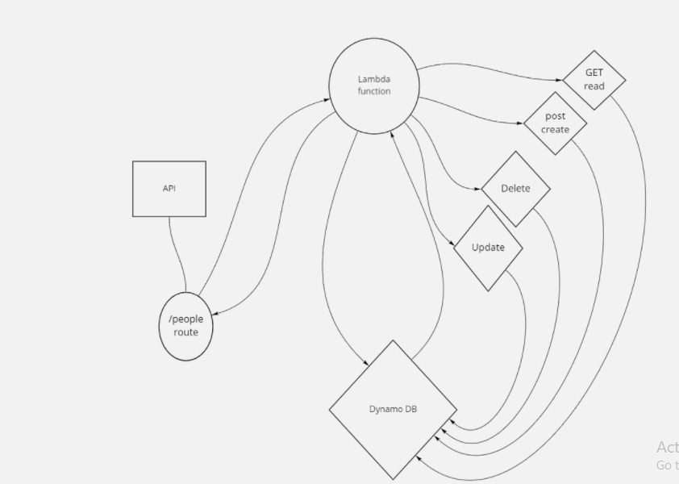

# serverless-api

What is the root URL to your API?

[API URL](https://ulggv8f5zb.execute-api.us-east-1.amazonaws.com)

What are the routes?

- POST

  - /people
    - Given a JSON body
    - returns an object representing one record, by its id

- GET
  - /people
    - returns an array of objects representing the records in the database
  - /people/##
    - returns an object representing one record, by its id
- PUT

  - /people/##
    - Given a JSON body and an ID (##), updates a record in the database

- DELETE
  - /people/## - Given an id (##) removes the matching record from the database
    returns an empty object

## UML

